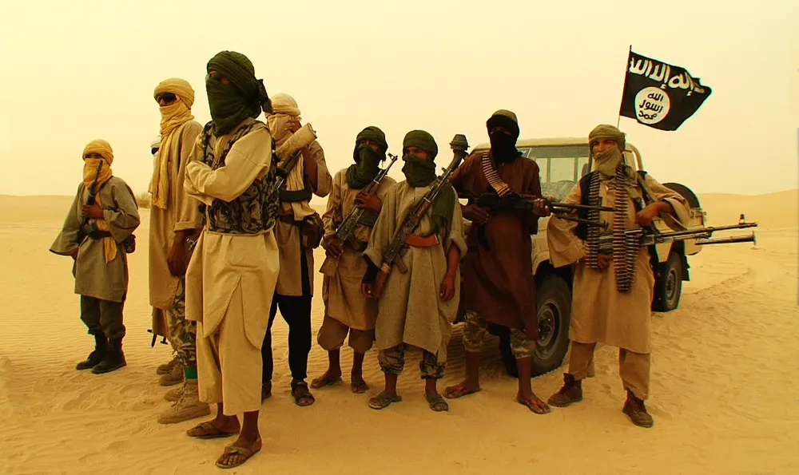

<html>
    <head>
    <meta charset="UTF-8">
    <meta name="viewport" content="width=device-width, initial-scale=1.0">
    <title>Popup-Fenster</title>
    
</head>
<body>

    

        
Mit dem Klick auf "OK" akzeptieren Sie unsere <a href="#nutzungsbedingungen" target="_blank">Nutzungsbedingungen</a> und <a href="#richtlinien"target="_blank">Richtlinien</a>.

        <button id="okButton" onclick="closePopup()">OK</button>
        <button id="cancelButton" onclick="closePage()">Abbrechen</button>
    

</body>
<body>
    <h2>Inhalt:</h2>
    <nav>
        <a href="#einführung">Einführung</a>  
        <a href="#ursachen">Ursachen</a> <b
        <a href="#verlauf">Verlauf</a>  
        <a href="#Infos der Feind-Freundkräfte">Infos der Feind-Freundkräfte</a>  
        <a href="#quellen">Quellen</a>
    </nav>
    <main>
        <section id="einführung">
            <h2>Einführung</h2>
    
Der Mali-Konflikt ist ein anhaltender politischer und bewaffneter Konflikt in der westafrikanischen Republik Mali. Dieser Konflikt hat komplexe Ursachen, die historische, soziale, wirtschaftliche und ethnische         Elemente umfassen.

    
Die Krise begann 2012, als verschiedene bewaffnete Gruppen, darunter separatistische Tuareg-Rebellen und islamistische Extremisten, große Teile des Nordens von Mali eroberten. Dies führte zu politischer                Instabilität und einer humanitären Krise in der Region.

    
Internationale Bemühungen, einschließlich Interventionen der Vereinten Nationen und regionaler Partner, wurden unternommen, um Frieden und Stabilität wiederherzustellen. Trotzdem bleibt die Situation komplex,            und der Konflikt hat weitreichende Auswirkungen auf die Menschen in Mali und die umliegenden Regionen.

        </section>
        <section id="ursachen">
            <h2>Ursachen des Mali-Konflikts</h2>
            
Der Konflikt in Mali hat verschiedene komplexe Ursachen, die oft auf politische, soziale und wirtschaftliche Faktoren zurückzuführen sind.

            <h3>1. Ethnische Spannungen</h3>
            
Die ethnische Vielfalt in Mali hat zu Spannungen zwischen verschiedenen Gruppen geführt, insbesondere zwischen den Tuareg-Rebellen im Norden und der Zentralregierung.

            <h3>2. Politische Instabilität</h3>
            
Mali hat in der Vergangenheit Perioden politischer Instabilität erlebt, einschließlich Putschversuchen und Regierungswechseln, die zur Schwächung der staatlichen Autorität beigetragen haben.

            <h3>3. Wirtschaftliche Probleme</h3>
            
Die wirtschaftliche Ungleichheit und Armut in bestimmten Regionen haben Frustrationen ausgelöst und zur Radikalisierung geführt, insbesondere unter Jugendlichen, die nach besseren Lebensbedingungen                   streben.

            <h3>4. Terrorismus und Extremismus</h3>
            
Die Präsenz terroristischer Gruppen, darunter Al-Qaida im Islamischen Maghreb (AQIM) und andere, hat zur Eskalation des Konflikts beigetragen, insbesondere im Norden Malis.

            
Diese Ursachen sind eng miteinander verbunden und tragen gemeinsam zur Komplexität des Mali-Konflikts bei.

        </section>
<section id="verlauf">
    <h2>Verlauf des Mali-Konflikts</h2>
    

        
Der Mali-Konflikt ist ein komplexes politisches und soziales Problem, das sich über mehrere Jahre erstreckt. Hier ist eine grobe Übersicht über den Verlauf:

<h3>1. Historischer Hintergrund</h3>
        
Der Konflikt hat seine Wurzeln in langjährigen Spannungen zwischen verschiedenen ethnischen Gruppen, wirtschaftlichen Problemen und politischer Instabilität in Mali.

        <!-- Weitere Abschnitte hier... -->

<h3>6. Aktuelle Situation</h3>
        
Der Konflikt ist bis heute anhaltend, und die Lage bleibt komplex. Internationale Organisationen und Friedensmissionen sind weiterhin in Mali aktiv, um Stabilität und Sicherheit zu fördern.

    

    

    
    

</section>

<section>
        <section id="Infos der Feind-Freundkräfte">
            <h2>Infos der Feind-Freundkräfte</h2>
            <h2>Al-Qaida im Islamischen Maghreb (AQMI)</h2>
            

    

        Al-Qaida im Islamischen Maghreb (AQMI) ist eine islamistische extremistische Gruppierung,
        die im nordafrikanischen Maghreb und Sahel-Gebiet aktiv ist. Sie entstand aus der algerischen
        Gruppierung Groupe Salafiste pour la Prédication et le Combat (GSPC) und schwor 2007 Al-Qaida die Treue.
    

    

        AQMI ist bekannt für ihre Aktivitäten wie Entführungen, Sprengstoffanschläge und den Schmuggel
        von Waffen in der Region. Die Gruppe hat Verbindungen zu anderen Al-Qaida-Zweigen und spielt
        eine bedeutende Rolle in der Instabilität in Mali und den umliegenden Gebieten.
    

    

        Die internationale Gemeinschaft, darunter Frankreich und die Vereinten Nationen, hat Maßnahmen
        ergriffen, um AQMI zu bekämpfen und die Sicherheit in der Region wiederherzustellen.
    

        

        

    
        

        
            <h2>Mujao in Mali</h2>

  

    Die Bewegung für Einheit und Dschihad in Westafrika (Mujao) ist eine islamistische Gruppierung, die im Zusammenhang mit dem Mali-Konflikt steht. Sie entstand während der Tuareg-Rebellion in Nordmali und ist für ihre Verbindungen zu al-Qaida im Islamischen Maghreb (AQIM) bekannt.
  

  

    Mujao hat sich an verschiedenen terroristischen Aktivitäten beteiligt und versucht, die politische Landschaft in der Sahel-Region zu beeinflussen. Die Gruppe strebt die Errichtung eines islamischen Staates in der Region an und hat sich gegen ausländische Interventionen, insbesondere die von Frankreich angeführte Operation Serval, ausgesprochen.
  

  

    Die Präsenz von Mujao und anderer extremistischer Gruppen hat zu erheblicher Instabilität in Mali geführt und stellt eine Bedrohung für die Sicherheit in der gesamten Sahelzone dar. Internationale Bemühungen, insbesondere durch die Vereinten Nationen und regionale Akteure, zielen darauf ab, den Konflikt zu lösen und die Stabilität in der Region wiederherzustellen.
  

  <h2>Ansar Dine</h2>
    

        Ansar Dine ist eine islamistische Gruppierung, die im Zusammenhang mit dem Mali-Konflikt steht. Die Organisation strebt die Einführung der Scharia in Mali an und hat Verbindungen zu anderen extremistischen Gruppen. Sie spielte eine Rolle in den Unruhen im Norden Malis und wird für zahlreiche Menschenrechtsverletzungen verantwortlich gemacht.
    

    

        Ansar Dine wurde im Jahr 2012 gegründet und war an verschiedenen Konflikten in der Sahel-Region beteiligt. Die Gruppe hat eine ablehnende Haltung gegenüber westlichen Einflüssen und strebt die Errichtung eines islamischen Staates an.
    

    

        Die internationale Gemeinschaft und regionale Kräfte haben sich aktiv bemüht, Ansar Dine und andere extremistische Gruppen in der Region zu bekämpfen, um Frieden und Stabilität wiederherzustellen.
    

    </section>
        <section id="quellen">
            <h2>Quellen</h2>
</section>
    <footer>
        <a href="Rick Astley - Never Gonna Give You Up (Official Music Video).mp4">Quellen</a>
        
&copy; 2024 Mali Konflikt Info

    </footer>
